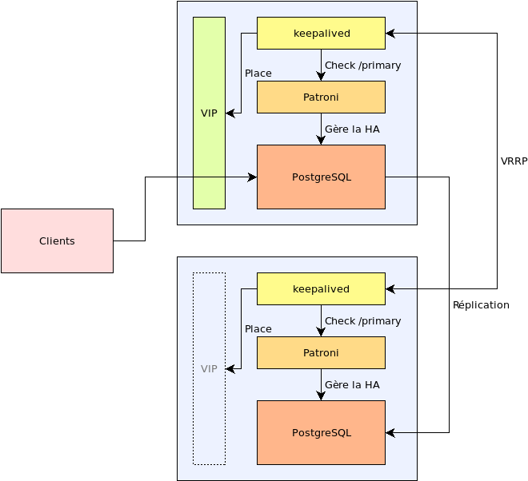

Patroni ne gère que le service PostgreSQL en pilotant la réplication. Il ne
fournit volontairement aucun moyen d'accès pour les applications. Elles doivent
pourtant déterminer quel serveur PostgreSQL est accessible en écriture, pour
cela une solution est de placer une adresse IP supplémentaire sur ce serveur en
écriture qui est déplacée automatique en cas de bascule.

Il faut donc ajouter un service supplémentaire à l'architecture pour gérer la
placement de cette adresse IP, généralement appelée, IP virtuelle, VIP, ou IP
flottante : Keepalived permet de le faire.

Keepalived est un logiciel de haute-disponibilité et d'équilibrage de charge
reposant sur le noyau Linux. Pour la haute disponibilité, il opère sur la
couche réseau de niveau 3 et implémente le protocole VRRP.

Le protocole VRRP permet de définir le porteur d'une ou plusieurs adresses IP
virtuelles parmi un ensemble de serveurs. En cas d'indisponibilité d'un
serveur, l'adresse IP est activée sur un autre serveur disponible.

Dans la configuration proposée, l'équilibrage de charge n'est pas
configuré. Keepalived a uniquement la responsabilité de placer une VIP sur le
serveur hébergeant l'instance PostgreSQL primaire, accessible en écriture, de
sorte que les applications clientes n'aient qu'un seul point d'accès au service
PostgreSQL en haute-disponibilité.

## Architecture

Un service keepalived est déployé sur chaque nœud PostgreSQL du cluster
Patroni, quelque soit le nombre total de nœuds hébergeant PostgreSQL.

Keepalived peut exécuter une ou plusieurs commandes de vérification
définies par l'administrateur. Ces commandes permettent de déterminer si la
machine peut monter l'adresse IP virtuelle. Ce mécanisme est utilisé pour
interroger l'API REST du service Patroni de chaque nœud du cluster.

Chaque service keepalived est configuré pour interroger l'API REST de Patroni en
HTTP, sur le point d'accès `/primary`. Lorsque la requête HTTP réussit avec le
code 200, la vérification réussit et indique à keepalived de monter l'adresse IP
virtuelle. Lorsque le code HTTP est 503, l'instance locale est un replica, le
script échoue et keepalived retire l'adresse IP virtuelle du serveur.



## Contraintes sur PostgreSQL

Pour s'assurer que l'instance PostgreSQL écoute les connexions des clients sur
l'adresse IP virtuelle, qu'elle soit montée ou non, le paramètre
`listen_addresses` doit être configuré à la valeur `'*'`.

## Mise en place

### Installation

Keepalived est fournit dans les dépôts de paquets des distributions cibles,
RHEL/CentOS, Debian et Ubuntu. Pour accéder à l'API REST de Patroni, l'outil
cURL est utilisé.

Sur RHEL/CentOS :

```
$ sudo yum install keepalived curl
```

Sur Debian et Ubuntu :

```
$ sudo apt install keepalived curl
```

### Configuration

Par la suite, la configuration du cluster est la suivante :

* Trois instances PostgreSQL, chacune hébergée sur un serveur distinct. Les
  adresses des nœuds sont : `10.0.2.3`, `10.0.2.4`, `10.0.2.5` ;
* L'adresse IP virtuelle pour le service PostgreSQL en écriture est : `10.0.2.12` ;
* Les quatre adresses sont dans le même sous-réseau ;
* L'API REST de chaque service Patroni est configurée pour écouter sur l'adresse
  du nœud, sur le port TCP 8008, en HTTP.

La configuration du service se fait dans le fichier
`/etc/keepalived/keepalived.conf`.

Le fichier est divisé en sections dont le contenu est entre accolades.

Tout d'abord, il faut définir un ensemble configuration dans la section
`global_defs` :

```
global_defs { 
  router_id PG1
  enable_script_security
  # vrrp_iptables # pour keepalived 1.3
}
```

Les paramètres sont les suivants :

* `router_id PG1` : l'identifiant alphanumérique du nœud dans le cluster doit
  être **unique**. La convention suivante est retenue :
  * 10.0.2.3 = PG1
  * 10.0.2.4 = PG2
  * 10.0.2.5 = PG3
* `enable_script_security` : keepalived refuse d'exécuter un script en
  utilisateur `root` si une partie de son chemin est accessible en écriture à
  d'autres utilisateurs que `root`. Cette sécurité permet de se prémunir
  contre des attaques par escalade de privilèges ;
* `vrrp_iptables` : ne pas configurer de règle de firewall pour l'adresse IP
  virtuelle, cette fonctionnalité est inutile dans le contexte présent. Il faut
  spécifier ce paramètre sans valeur pour désactiver la fonctionnalité pour les
  versions plus anciennes de keepalived (1.3 sur CentOS 7)

Pour interroger l'API REST de Patroni avec `curl`, il faut définir la ligne de
commande de vérification dans une section `vrrp_script` :

```
vrrp_script check_patroni_primary {
  script "/usr/bin/curl -X GET -I --fail http://10.0.2.3:8010/primary"
  user root
}
```

La ligne de commande exécute une requête sur la ressource `/primary` du nœud
**local** :

* L'adresse IP ou nom du service et le port TCP doivent correspondre à la
  valeur du paramètre `restapi.listen` de Patroni, elle dépend de chaque nœud ;
* Keepalived étant exécuté en tant que root, la configuration par défaut de
  SELinux sur RHEL/CentOS impose que les commandes qu'il déclenche soient aussi
  exécutées avec l'utilisateur `root`.

Enfin, il faut définir la configuration de l'adresse IP virtuelle avec une
section `vrrp_instance` :

```
vrrp_instance RW {
  state BACKUP
  interface eth0
  unicast_peer {
    10.0.2.4
    10.0.2.5
  }
  advert_int 1
  authentication {
    auth_type PASS
    auth_pass rGNTny9l
  }
  virtual_ipaddress {
    10.0.2.12/24 dev eth0 label eth0:1
  }
  track_script {
    check_patroni_primary
  }
  no_accept
}
```

Voici le détail :

* Le nom de l'instance, `RW`, est arbitraire ;
* `state` : `MASTER` ou `BACKUP`, c'est l'état initial de l'instance VRRP. Ce
  paramètre perd sa valeur dès lors que l'exécution de la commande de
  vérification commence et que d'autres nœuds sont activés. Seul le nœud
  hébergeant l'instance en écriture peut monter l'adresse IP virtuelle ;
* `interface` : le nom de l'interface réseau utilisée par le protocole VRRP ;
* `unicast_peer` : pour éviter tout effet de bord, l'utilisation du multicast
  pour communiquer avec les autres nœuds du cluster est désactivée au profit de
  l'unicast. Il est alors nécessaire de déclarer les autres nœuds du cluster
  dans cette sous-section ;
* `advert_int` : intervalle de temps entre les annonces VRRP, en secondes ;
* `authentication` : authentification entre nœuds, utile pour ajouter une
  sécurité en unicast. Le mot de passe doit être identique sur l'ensemble des
  nœuds ;
* `virtual_ipaddress` : liste des adresses IP virtuelles à gérer. La syntaxe
  utilisée est proche de celle de la commande système `ip`, les mots clés `dev`
  et `label` permettent de choisir l'interface réseau cible et le nom de
  l'alias ;
* `track_script` : la liste des scripts de vérification à exécuter. On utilise
  les noms des sections `vrrp_script`, ici la commande pour interroger l'API REST
  de Patroni ;
* `no_accept` : permet d'ignorer les paquets réseaux qui ne sont pas destinés à
  une adresse présente sur le nœud. Tout trafic réseau vers l'adresse IP
  virtuelle est alors stoppé lorsqu'elle est démontée.

### Activation du service

Le service est géré par systemd :

```
$ sudo systemctl enable --now keepalived
```

## Supervision

Keepalived écrit ses logs dans syslog, ils sont donc disponibles dans le journal.

Il est possible de superviser le service en SNMP. Keepalived est également capable
d'envoyer des mails (SMTP).

Un script peut être exécuté lors des changements d'état, en configurant les
paramètres suivants dans la section `vrrp_instance` du fichier de
configuration :

* `notify_master` : L'adresse IP est montée, l'instance PostgreSQL locale est
  accessible en écriture
* `notify_fault` : Le script de vérification échoue, l'instance PostgreSQL locale
  est un *replica*.

La syntaxe est la suivante : `notify_xxx <STRING>|<QUOTED-STRING> [username
[groupname]]`

## Fichier de configuration complet

Voici le fichier de configuration final, pour le premier nœud du cluster :

```
global_defs {
  router_id PG1 # Doit être unqiue
  vrrp_skip_check_adv_addr
  enable_script_security
  vrrp_iptables
  script_user root
}

# Vérification du nœud local
vrrp_script check_patroni_primary {
  script "/usr/bin/curl -X GET -I --fail http://10.0.2.3:8010/primary"
}

vrrp_instance RW {
  state MASTER
  interface eth0
  
  # Autres nœuds du cluster
  unicast_peer {
    10.0.2.4
    10.0.2.5
  }
  virtual_router_id 3
  priority 150
  advert_int 1
  authentication {
    auth_type PASS
    auth_pass ****  # mot de passe commun au cluster
  }
  virtual_ipaddress {
    10.0.2.12/24 dev eth0 label eth0:1
  }
  track_script {
    check_patroni_primary
  }
  no_accept
}
```

Les éléments suivants doivent être adaptés sur les autres nœuds :

* la valeur de `router_id` ;
* l'URL du web service Patroni ;
* la liste des autres nœuds dans `unicast_peer` ;
* le mot de passe de l'authentification de l'instance VRRP ;

## Inconvénient

Si cette méthode ayant l'avantage d'être facile à mettre en œuvre, le fait
d'avoir en permanence des échecs du script de vérification du service primaire
sur les nœuds en lecture seule fait qu'on a des messages de logs toutes les
secondes, pour un comportement normal.
