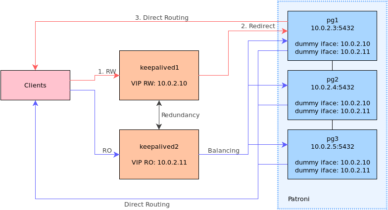

Patroni ne gère que le service PostgreSQL en pilotant la réplication. Les
applications doivent déterminer quelle est l'instance disponible en écriture et
quelle est la ou les instances en lecture seule.

Pour fournir un point d'accès unique, sous la forme d'une adresse IP virtuelle,
il faut ajouter un service ou mécanisme supplémentaire. Keepalived fournit ce
service, il est également capable d'équilibrer les connexions entre plusieurs
instances.

Keepalived est un logiciel de haute-disponibilité et d'équilibrage de charge
reposant sur le noyau Linux. Pour la haute disponibilité, il opère sur la
couche réseau de niveau 3 et implémente le protocole VRRP.

Pour l'équilibrage de charge, Keepalived opére sur la couche réseau de niveau 4
et utilise la fonctionnalité IPVS du noyau Linux. Le load-balancing se fait soit par
translation d'adresse (NAT) soit par re-routage (DR pour Direct Routing).

Le NAT n'est possible que si les clients et la VIP sont dans un sous-réseau
différent des serveurs PostgreSQL, ce qui rend la configuration plus complexe.

Le *Direct Routing* fonctionne par réécriture de l'adresse MAC du paquet en
provenance du client puis transmission au serveur PostgreSQL, forçant le
serveur PostgreSQL à répondre directement au client. Cela impose de configurer
la VIP sur chaque serveur PostgreSQL pour qu'ils répondent aux clients. Cela
impose également de pouvoir contrôler la capacité à répondre aux requêtes ARP à
la volée, car un seul serveur doit pourvoir être joint par les clients.

Ainsi, pour pouvoir faire du *load balancing*, il faut des machines dédiées à
Keepalived. Le protocole VRRP permet de redonder le service de *load balancing*,
en définissant le porteur d'une ou plusieurs adresses IP virtuelles parmi un
ensemble de serveurs Keepalived.  En cas d'indisponibilité d'un serveur
Keepalived, l'adresse IP est activée sur un autre serveur Keepalived
disponible.

## Architecture

Dans le contexte de la réplication PostgreSQL, il est possible de fournir une
VIP pour le service en écriture. Du point de vue de keepalived, il s'agit d'une
configuration de *load balancing* avec un seul serveur final actif, les autres
étant exclus du fait qu'il sont en lecture seule.

Avec une configuration de *load balancing* il est possible de répartir la charge
en lecture seule à destination d'une unique VIP vers *N* instances PostgreSQL en
réplication.



Un service keepalived est déployé sur deux machines dédiées. Il permet aux
applications d'accéder en lecture/écriture et lecture seule par l'intermédiaire
de deux adresses IP.

Le *Direct Routing* réduit le trafic réseau sur les machines keepalived en
laissant les serveur PostgreSQL répondre directement aux clients, On configure
alors les VIP sur tous les serveurs PostgreSQL via des interfaces réseau
`dummy` qui ne provoquent pas de trafic ARP (on évite ainsi les conflits).

Enfin, la détection du rôle de l'instance dans la réplication se fait par une
requête HTTP sur le webservice de Patroni. Selon le résultat, keepalived
autorise la redirection des paquets réseau vers la machine PostgreSQL.


## Installation

Keepalived est fournit dans les dépôts de paquets des distributions classiques,
RHEL/CentOS, Debian et Ubuntu. Pour le monitoring du *load balancing*, l'outil `ipvsadm` est
utile.

L'installation ne concerne que les deux machines hébergeant Keepalived, il n'y
a rien à installer de particulier sur les serveurs PostgreSQL.

Sur RHEL/CentOS :

```
$ sudo yum install -y keepalived ipvsadm
```

Sur Debian et Ubuntu :

```
$ sudo apt install keepalived ipvsadm
```

Si SELinux est activé sur RHEL/CentOS, il faut autoriser le trafic réseau pour
Keepalived :

```
$ sudo semanage boolean -m --on keepalived_connect_any
```

## Configuration

Par la suite, la configuration du cluster est la suivante :

* Deux machines Keepalived ;
* Trois instances PostgreSQL, chacune hébergée sur un serveur distinct. Les
  adresses des nœuds sont : `10.0.2.3`, `10.0.2.4`, `10.0.2.5` ;
* L'adresse IP virtuelle pour le service PostgreSQL **en écriture** est : `10.0.2.10` ;
* L'adresse IP virtuelle pour le service PostgreSQL **en lecture seule** est : `10.0.2.11` ;
* Les adresses IP sont dans le même sous-réseau ;
* L'API REST de chaque service Patroni est configurée pour écouter sur l'adresse
  du nœud, sur le port TCP 8008, en HTTP.

La configuration du service se fait dans le fichier
`/etc/keepalived/keepalived.conf`.

Pour chaque IP virtuelle utilisée comme point d'entrée pour un équilibrage
entre plusieurs serveurs PostgreSQL, il faut définir :

* Une instance VRRP entre les deux machines Keepalived (aussi nommés par la
  suite load balancer) pour la redondance du service de *load balancing* ;
* Un « virtual server » avec *N* « real servers » correspondant au groupe
  d'instances PostgreSQL destinataires des connexions.

Le fichier de configuration de Keepalived est divisé en sections dont le
contenu est entre accolades.

Tout d'abord, il faut définir un ensemble configuration dans la section
`global_defs` :

```
global_defs {
  router_id KAD1
  vrrp_strict
  enable_script_security
  script_user root
}
```

Les paramètres sont les suivants :

* `router_id KAD1` : l'identifiant alphanumérique du *load-balancer*, qui doit
  être **unique**. On les nomme `KAD1` et `KAD2`.
* `enable_script_security` : keepalived refuse d'exécuter un script en
  utilisateur `root` si une partie de son chemin est accessible en écriture à
  d'autres utilisateurs que `root`. Cette sécurité permet de se prémunir
  contre des attaques par escalade de privilèges ;
* `script_user root` : utilisateur par défaut pour l'exécution des scripts de
  vérification ;

Les sections suivantes décrivent la suite de la configuration.

### Algorithmes d'équilibrage

L'équilibrage des connexions est réalisé grâce à la fonctionnalité « Linux
Virtual Server » du noyau Linux qui possède différents algorithmes. Leur
description est documentée dans la page de manuel de `ipvsadm`.

Certains algorithmes sont pondérés, permettant d'adapter manuellement
l'équilibrage selon la puissance de la machine PostgreSQL.

Pour répartir les connexions simplement, on choisit l'algorithme
"Least-Connection" (`lc`).

### IP virtuelle pour les écritures

Dans une configuration avec des load balancers dédiés, fournir une IP virtuelle
pour l'instance PostgreSQL accessible en écriture revient à configurer un load
balancing avec un seul serveur PostgreSQL disponible.

La redondance entre les load-balancers pour l'adresse IP virtuelle en écriture
se fait dans une instance VRRP distincte de celle des lectures seules, de façon
à pouvoir utiliser un load balancer pour les lectures/écritures et l'autre pour
les lectures seules.

On définit donc une section `vrrp_instance` sur chaque load balancer :

```
# KAD1
vrrp_instance PGRW {
  state MASTER
  interface eth0
  virtual_router_id 1
  priority 150
  advert_int 1
  virtual_ipaddress {
    10.0.2.10/24 dev eth0 label eth0:1
  }
}
```

Selon le load balancer, il faut adapter les paramètres suivants :

* `state` : MASTER ou BACKUP, définit la position initiale de l'IP virtuelle ;
* `priority` : 150 pour le load balancer principal et 100 pour le secondaire, le
  load balancer avec la priorité la plus élevée remporte l'élection et acquiert
  l'IP virtuelle.

Le paramètre `virtual_router_id` doit être le même sur les deux load balancers
pour une instance donnée. Il permet de différencier cette instance de celle
pour les lectures seules sur la même interface réseau.

Les autres paramètres sont :

* `interface` : nom de l'interface réseau, doit être cohérente avec la
  sous-section `virtual_ipaddress` ;
* `advert_int` : intervalle en seconde entre les annonces VRRP ;
* `virtual_ipaddress`_: définition de l'adresse IP virtuelle, ici on la déclare
  comme alias numéro 1 de l'interface réseau.

Cela donne pour KAD2 :

```
# KAD2
vrrp_instance PGRW {
  state BACKUP
  interface eth0
  virtual_router_id 1
  priority 100
  advert_int 1
  virtual_ipaddress {
    10.0.2.10/24 dev eth0 label eth0:1
  }
}
```

La configuration des redirections entre les nœuds du cluster Patroni se fait
dans une section `virtual_server` :

```
virtual_server 10.0.2.10 5432 {
  lvs_method DR
  lb_algo lc # least connected
  protocol TCP

  delay_loop 1
  delay_before_retry 1
  connect_timeout 1
  warmup 0
  persistence_timeout 1

  # Bloc à répéter pour chaque instance PostgreSQL
  real_server 10.0.2.x 5432 {
    weight 50
    inhibit_on_failure
    HTTP_GET {
      connect_port 8008
      url {
        path /primary
        status_code 200
      }
    }
  }
}
```

Les paramètres sont :

* `lvs_method` : `DR` pour *Direct Routing*. Le load balancer remplace l'adresse
  MAC dans le paquet réseau à destination de l'IP virtuelle par celle du
  serveur PostgreSQL et réémet le paquet. Le serveur PostgreSQL répond alors
  directement au client.
* `lb_algo` : `lc` pour *Least-Connection*. Algorithme d'équilibrage de charge où
  les nouvelles connexions sont transmises aux serveurs PostgreSQL ayant le
  moins de connexion. Pour les lectures/écritures, l'algorithme a peu
  d'importance du fait qu'il n'y a toujours qu'une instance PostgreSQL
  accessible en écriture.
* `protocol` : `TCP`. Obligatoirement TCP, PostgreSQL utilise TCP.

Les paramètres relatifs aux délais et timeouts de connextion sont placés au
minimum pour suivre les changements de topologie du cluster Patroni au plus
vite :

* `delay_loop` : intervalle en second entre les vérifications de disponibilité des
  serveurs PostgreSQL ;
* `delay_before_retry` : temps d'attente en secondes après un échec de
  vérification, avant de réessayer ;
* `connect_timeout` : timeout de connection si l'instance ne réponds pas ;
* `warmup` : temps d'attente maximum en secondes pour la première vérification,
  on le place à 0 pour déasctiver ce délai ;
* `persistence_timeout` : positionné à 1, ce paramètre force le load balancer à
  ne pas conserver d'affinité entre les clients et les serveurs
  PostgreSQL. Cela permet de ne pas renvoyer un client sur la même instance
  après bascule parce qu'elle s'y était connecté auparavant, et ainsi garantir
  que la bascule est effective.

Enfin, il faut déclarer un sous-bloc `real_server` pour **chaque** instance
PostgreSQL. On remarque que le port est celui de l'instance PostgreSQL. Le port
du webservice de Patroni n'est utilisé que pour la vérification de
disponibilité. Les paramètres sont :

* `weight` : poids du serveur dans le load balancing. Un poids à `0` désactive le
  serveur. Cette valeur est intéressante pour les algorithmes d'équilibrage de
  charge pondérés ;
* `inhibit_on_failure` : positionne le poids du serveur à `0` pour l'exclure du
  load balancing. Les instances replica auront donc ce poids et ne recevront
  pas de connexions en lecture/écriture.

Pour déterminer le rôle et vérifier la disponibilité de l'instance, on utilise
une requête HTTP (`HTTP_GET`) sur le port du webservice Patroni
(`connect_port`) : la méthode GET sur l'URL `/primary` doit renvoyer un code
200 pour que le load balancer envoie des connexions vers ce serveur.

### IP virtuelle pour les lectures seules

Pour les lectures seules, la configuration utilise les mêmes principes que pour
l'IP virtuelle de l'accès en écriture :

* On déclare une instance VRRP (avec `virtual_router_id` différent) un en
  plaçant la priorité sur le second load balancer, ainsi séparer le trafic
  entre les load balancers ;
* On déclare un LVS en Direct Routing avec les serveur PostgreSQL, seul le
  mécanisme de vérification change :
  * Pour n'équilibrer les lectures que sur les replica, on utilise `HTTP_GET` sur
    le webservice Patroni vers le chemin `/replica` ;
  * Pour équilibrer vers tous les serveurs PostgreSQL disponibles, y compris le
    primaire, on utilise `TCP_CHECK` directement sur l'instance PostgreSQL, c'est
    plus performant.


Cela donne pour KAD1, par exemple :

```
vrrp_instance PGRO {
  state BACKUP
  interface eth0
  virtual_router_id 2
  priority 100
  advert_int 1
  virtual_ipaddress {
    10.0.2.11/24 dev eth0 label eth0:2
  }
}

virtual_server 10.0.2.11 5432 {
  lvs_method DR
  lb_algo lc # least connected
  protocol TCP

  delay_loop 1
  delay_before_retry 1
  connect_timeout 1
  warmup 0
  persistence_timeout 0

  real_server 10.0.2.3 5432 {
    weight 50
    inhibit_on_failure
    HTTP_GET {
      connect_port 8008
      url {
        path /replica
        status_code 200
      }
    }
  }
  
  real_server 10.0.2.4 5432 {
    weight 50
    inhibit_on_failure
    HTTP_GET {
      connect_port 8008
      url {
        path /replica
        status_code 200
      }
    }
  }
  
  real_server 10.0.2.5 5432 {
    weight 50
    inhibit_on_failure
    HTTP_GET {
      connect_port 8008
      url {
        path /replica
        status_code 200
      }
    }
  }
}
```

Si on souhaite inclure l'instance primaire, les blocs `real_server` deviennent :

```
real_server 10.0.2.x 5432 {
  weight 50
  inhibit_on_failure
  TCP_CHECK {
    connect_timeout 1
  }
}
```

### Interfaces dummy sur les serveurs PostgreSQL

Les opérations suivantes sont à réaliser sur les serveurs PostgreSQL
seulement.

Pour qu'ils soient en mesure de répondre aux clients, les serveurs PostgreSQL
doivent se considérer comme destinataires des paquets réseaux à destination des
VIP, sans générer de trafic ARP pour ces adresses. Utiliser une interface
réseau `dummy` pour placer les VIP sur les serveurs PostgreSQL est dans ce cas
la solution la plus simple.

Configurer le chargement du module dummy au démarrage de la machine en créant
le fichier `/etc/modules-load.d/dummy.conf` avec le contenu :

```
dummy
```

Configurer les options de chargement du module dans `/etc/modprobe.d/z-dummy.conf` :

```
options dummy numdummies=1
```

Charger le module :

```
modprobe dummy
```

Sur RHEL/CentOS 7, créer un fichier de configuration pour l'interface, il doit
être *après* le fichier de l'interface principale dans l'ordre alphabétique,
sinon la route par défaut sera placée sur l'interface `dummy` :

Pour l'IP virtuelle de l'accès en lecture/écriture, `/etc/sysconfig/network-scripts/ifcfg-vip1` :

```
DEVICE=dummy0
DEFROUTE=no
BOOTPROTO=none
IPADDR=10.0.2.10
NETMASK=255.255.255.0
ONBOOT=yes
TYPE=Ethernet
NM_CONTROLLED=no
```

Pour l'IP virtuelle de l'accès en lecture seule, `/etc/sysconfig/network-scripts/ifcfg-vip2` :

```
DEVICE=dummy0:0
DEFROUTE=no
BOOTPROTO=none
IPADDR=10.0.2.11
NETMASK=255.255.255.0
ONBOOT=yes
TYPE=Ethernet
NM_CONTROLLED=no
```

Activer les interfaces :

```
$ sudo ifup vip1
$ sudo ifup vip2
```

Sur RHEL/CentOS 8, utiliser `nmcli` :

```
$ sudo nmcli connection add type dummy ifname dummy0 \
    ipv4.method manual ipv4.addresses "10.0.2.10/24, 10.0.2.11/24"
$ sudo nmcli connection up dummy-dummy0
```

Sur Debian/Ubuntu, dans `/etc/network/interfaces` :

```
auto dummy0
iface dummy0 inet static
    address 10.0.2.10/24
    
auto dummy0:0
iface dummy0:0 inet static
    address 10.0.2.11/24
```
Activer les interfaces :

```
$ sudo ifup vip1
$ sudo ifup vip2
```

### Activation du service

Le service est géré par systemd :

```
$ sudo systemctl enable --now keepalived
```

Les messages et traces de Keepalived sont écrites dans syslog et apparaissent
dans le journal.

Les modifications de configuration, comme un ajout ou une suppression de
`real_server` requièrent seulement un rechargement du service :

```
$ sudo systemctl reload keepalived
```

## Supervision

On peut configurer les instances VRRP pour que des notifications soit envoyées
sur les changements d'état. Cela peut se faire par mail (SMTP) ou par
l'exécution de scripts (paramètres `notify_master`, `notify_backup`,
`notify_fault`, etc)

Pour les blocs `real_server`, les paramètres sont `notify_up` et `notify_down`.

La syntaxe des paramètres de notification est :

```
notify_XXX <STRING>|<QUOTED-STRING> [username [groupname]]
```

Pour examiner l'équilibrage de charge, l'outil `ipvsadm` est intéressant, par
exemple pour la VIP en écriture (le poids indique l'instance primaire) :

```
# ipvsadm -l -n
IP Virtual Server version 1.2.1 (size=4096)
Prot LocalAddress:Port Scheduler Flags
  -> RemoteAddress:Port           Forward Weight ActiveConn InActConn
TCP  10.0.2.10:5432 lc
  -> 10.0.2.3:5432                Route   0      0          0
  -> 10.0.2.4:5432                Route   50     0          0
  -> 10.0.2.5:5432                Route   0      0          0
```

## Tests

Les tests ont été réalisés avec la configuration décrite précédemment sur des
machines virtuelles KVM en CentOS 8.2, avec Keepalived v2.1.5 et PostgreSQL
13.3.

### Ecritures et bascule

Préparer un utilisateur et une base de données pour les tests :

```
$ export PGPASSWORD="xxxx"
$ createuser -h 10.0.2.10 -U postgres -P my_user 
$ createdb -h 10.0.2.10 -U postgres my_db
$ psql -h 10.0.2.10 -U my_user -c "create table t1 (i int)" my_db
```

Lancer une boucle qui insère une ligne toutes les secondes :

```
$ while $(true); \
    do psql -X -h 10.0.2.10 -U my_user -c "insert into t1 values (1)" my_db; \
    sleep 1; done
```

Voici l'état du load balancing sur la machine keepalived qui porte l'IP
virtuelle en écriture (on remarque le poids à 50 pour le *Leader*) :

```
$ ipvsadm -l -n
IP Virtual Server version 1.2.1 (size=4096)
Prot LocalAddress:Port Scheduler Flags
  -> RemoteAddress:Port           Forward Weight ActiveConn InActConn
TCP  10.0.2.10:5432 lc
  -> 10.0.2.3:5432                Route   0      0          0
  -> 10.0.2.4:5432                Route   0      0          0
  -> 10.0.2.5:5432                Route   50     0          9
TCP  10.0.2.11:5432 lc
  -> 10.0.2.3:5432                Route   50     0          0
  -> 10.0.2.4:5432                Route   50     0          0
  -> 10.0.2.5:5432                Route   50     0          0
```

On provoque alors une bascule coté Patroni :
  
```
$ patronictl switchover
```

Lorsque le cluster est revenu à un état stable, `ipvsadm` montre l'évolution des
poids, le *Leader* à changé :

```
$ ipvsadm -l -n
IP Virtual Server version 1.2.1 (size=4096)
Prot LocalAddress:Port Scheduler Flags
  -> RemoteAddress:Port           Forward Weight ActiveConn InActConn
TCP  10.0.2.10:5432 lc
  -> 10.0.2.3:5432                Route   50     0          0
  -> 10.0.2.4:5432                Route   0      0          0
  -> 10.0.2.5:5432                Route   0      9          3
TCP  10.0.2.11:5432 lc
  -> 10.0.2.3:5432                Route   50     0          0
  -> 10.0.2.4:5432                Route   50     0          0
  -> 10.0.2.5:5432                Route   50     0          0
```

Du côté de « l'application », on a les traces suivantes, montrant la bascule,
qui a duré environ 15 secondes :

```
INSERT 0 1
INSERT 0 1
INSERT 0 1
INSERT 0 1
psql: error: FATAL:  the database system is shutting down
FATAL:  the database system is shutting down
psql: error: FATAL:  the database system is shutting down
FATAL:  the database system is shutting down
psql: error: FATAL:  the database system is shutting down
FATAL:  the database system is shutting down
psql: error: could not connect to server: Connection refused
	Is the server running on host "10.0.2.10" and accepting
	TCP/IP connections on port 5432?
psql: error: could not connect to server: Connection refused
	Is the server running on host "10.0.2.10" and accepting
	TCP/IP connections on port 5432?
psql: error: could not connect to server: Connection refused
	Is the server running on host "10.0.2.10" and accepting
	TCP/IP connections on port 5432?
psql: error: could not connect to server: Connection refused
	Is the server running on host "10.0.2.10" and accepting
	TCP/IP connections on port 5432?
psql: error: could not connect to server: Connection refused
	Is the server running on host "10.0.2.10" and accepting
	TCP/IP connections on port 5432?
psql: error: could not connect to server: Connection refused
	Is the server running on host "10.0.2.10" and accepting
	TCP/IP connections on port 5432?
psql: error: could not connect to server: Connection refused
	Is the server running on host "10.0.2.10" and accepting
	TCP/IP connections on port 5432?
psql: error: could not connect to server: Connection refused
	Is the server running on host "10.0.2.10" and accepting
	TCP/IP connections on port 5432?
ERROR:  cannot execute INSERT in a read-only transaction
ERROR:  cannot execute INSERT in a read-only transaction
psql: error: could not connect to server: Connection refused
	Is the server running on host "10.0.2.10" and accepting
	TCP/IP connections on port 5432?
INSERT 0 1
INSERT 0 1
INSERT 0 1
INSERT 0 1
```

### Equilibrage de charge

La machine de test n'étant pas assez puissante (surtout au
niveau du nombre de CPU/Core), le résultat du bench importe moins que la
répartition des connexions entre les machines.

Initialiser la base de données pour pgbench :

```
$ pgbench -h 10.0.2.10 -U my_user -i my_db
```

Lancer un pgbench en lecture seule sur l'instance primaire en lecture/écriture :

```
$ pgbench -h 10.0.2.10 -U my_user -n -S -j 4 -c 75 -T 30 my_db
transaction type: <builtin: select only>
scaling factor: 1
query mode: simple
number of clients: 75
number of threads: 4
duration: 30 s
number of transactions actually processed: 176106
latency average = 12.843 ms
tps = 5839.685783 (including connections establishing)
tps = 5848.370529 (excluding connections establishing)
```

Durant l'exécution, `ipvsadm` montre la répartition des connexions :

```
$ ipvsadm -l -n
IP Virtual Server version 1.2.1 (size=4096)
Prot LocalAddress:Port Scheduler Flags
  -> RemoteAddress:Port           Forward Weight ActiveConn InActConn
TCP  10.0.2.10:5432 lc
  -> 10.0.2.3:5432                Route   50     75         1
  -> 10.0.2.4:5432                Route   0      0          0
  -> 10.0.2.5:5432                Route   0      0          0
TCP  10.0.2.11:5432 lc
  -> 10.0.2.3:5432                Route   50     0          0
  -> 10.0.2.4:5432                Route   50     0          0
  -> 10.0.2.5:5432                Route   50     0          0
```

Puis sur l'IP virtuelle en lecture seule :

```
$ pgbench -h 10.0.2.11 -U my_user -n -S -j 4 -c 75 -T 30 my_db
transaction type: <builtin: select only>
scaling factor: 1
query mode: simple
number of clients: 75
number of threads: 4
duration: 30 s
number of transactions actually processed: 220756
latency average = 10.221 ms
tps = 7337.509985 (including connections establishing)
tps = 7343.683211 (excluding connections establishing)
```

Durant l'exécution, `ipvsadm` montre la répartition des connexions entre les
instances PostgreSQL, prouvant l'équilibrage de charge :

```
$ ipvsadm -l -n
IP Virtual Server version 1.2.1 (size=4096)
Prot LocalAddress:Port Scheduler Flags
  -> RemoteAddress:Port           Forward Weight ActiveConn InActConn
TCP  10.0.2.10:5432 lc
  -> 10.0.2.3:5432                Route   50     0          0
  -> 10.0.2.4:5432                Route   0      0          0
  -> 10.0.2.5:5432                Route   0      0          0
TCP  10.0.2.11:5432 lc
  -> 10.0.2.3:5432                Route   50     25         0
  -> 10.0.2.4:5432                Route   50     25         0
  -> 10.0.2.5:5432                Route   50     25         0
```

## Fichiers de configuration complets

### Load balancer KAD1

```
global_defs {
  router_id KAD1
  vrrp_strict
  enable_script_security
  script_user root
}

vrrp_instance PGRW {
  state MASTER
  interface eth0
  virtual_router_id 1
  priority 150
  advert_int 1
  virtual_ipaddress {
    10.0.2.10/24 dev eth0 label eth0:1
  }
}

virtual_server 10.0.2.10 5432 {
  delay_loop 1
  lvs_method DR
  lb_algo lc # least connected
  persistence_timeout 1
  protocol TCP

  delay_before_retry 1
  connect_timeout 1
  warmup 0
  
  real_server 10.0.2.3 5432 {
    weight 50
    inhibit_on_failure
    HTTP_GET {
      connect_port 8010
      url {
        path /primary
        status_code 200
      }
    }
  }

  real_server 10.0.2.4 5432 {
    weight 50
    inhibit_on_failure
    HTTP_GET {
      connect_port 8010
      url {
        path /primary
        status_code 200
      }
    }
  }

  real_server 10.0.2.5 5432 {
    weight 50
    inhibit_on_failure
    HTTP_GET {
      connect_port 8010
      url {
        path /primary
        status_code 200
      }
    }
  }
}

vrrp_instance PGRO {
  state BACKUP
  interface eth0
  virtual_router_id 2
  priority 100
  advert_int 1
  virtual_ipaddress {
    10.0.2.11/24 dev eth0 label eth0:2
  }
}

virtual_server 10.0.2.11 5432 {
  delay_loop 1
  lvs_method DR
  lb_algo lc # least connected
  persistence_timeout 1
  protocol TCP

  delay_before_retry 1
  connect_timeout 1
  warmup 0

  real_server 10.0.2.3 5432 {
    weight 50
    inhibit_on_failure
    TCP_CHECK {
      connect_timeout 1
    }
  }

  real_server 10.0.2.4 5432 {
    weight 50
    inhibit_on_failure
    TCP_CHECK {
      connect_timeout 1
    }
  }

  real_server 10.0.2.5 5432 {
    weight 50
    inhibit_on_failure
    TCP_CHECK {
      connect_timeout 1
    }
  }
}
```

### Load balancer KAD2

```
global_defs {
  router_id KAD2
  vrrp_strict
  enable_script_security
  script_user root
}

vrrp_instance PGRW {
  state BACKUP
  interface eth0
  virtual_router_id 1
  priority 100
  advert_int 1
  virtual_ipaddress {
    10.0.2.10/24 dev eth0 label eth0:1
  }
}

virtual_server 10.0.2.10 5432 {
  delay_loop 1
  lvs_method DR
  lb_algo lc # least connected
  persistence_timeout 1
  protocol TCP

  delay_before_retry 1
  connect_timeout 1
  warmup 0

  real_server 10.0.2.3 5432 {
    weight 50
    inhibit_on_failure
    HTTP_GET {
      connect_port 8010
      url {
        path /primary
        status_code 200
      }
    }
  }

  real_server 10.0.2.4 5432 {
    weight 50
    inhibit_on_failure
    HTTP_GET {
      connect_port 8010
      url {
        path /primary
        status_code 200
      }
    }
  }

  real_server 10.0.2.5 5432 {
    weight 50
    inhibit_on_failure
    HTTP_GET {
      connect_port 8010
      url {
        path /primary
        status_code 200
      }
    }
  }
}

vrrp_instance PGRO {
  state MASTER
  interface eth0
  virtual_router_id 2
  priority 150
  advert_int 1
  virtual_ipaddress {
    10.0.2.11/24 dev eth0 label eth0:2
  }
}

virtual_server 10.0.2.11 5432 {
  lvs_method DR
  lb_algo lc # least connected
  persistence_timeout 1
  protocol TCP

  delay_loop 1
  delay_before_retry 1
  connect_timeout 1
  warmup 0

  real_server 10.0.2.3 5432 {
    weight 50
    inhibit_on_failure
    TCP_CHECK {
      connect_timeout 1
    }
  }

  real_server 10.0.2.4 5432 {
    weight 50
    inhibit_on_failure
    TCP_CHECK {
      connect_timeout 1
    }
  }

  real_server 10.0.2.5 5432 {
    weight 50
    inhibit_on_failure
    TCP_CHECK {
      connect_timeout 1
    }
  }
}
```
